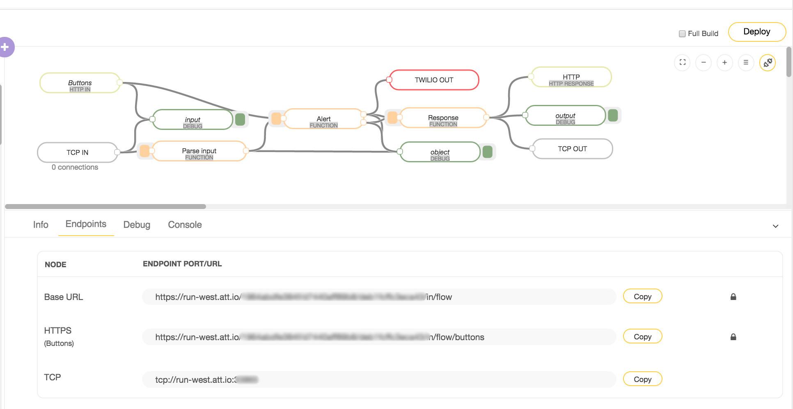
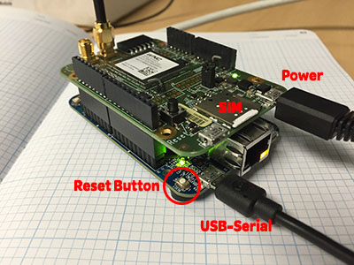
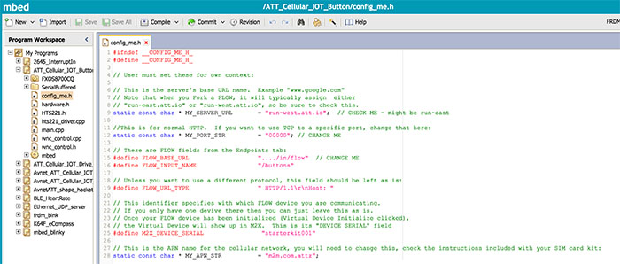
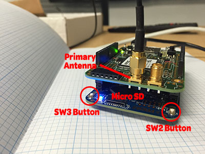
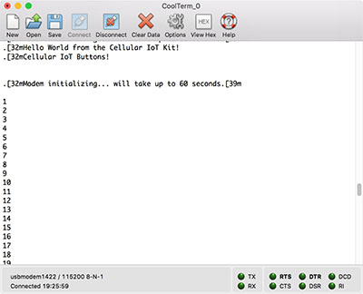

# Cellular IoT Button

|   Author   | Created At  | Updated On  |
| ---------- | ----------- | ----------- |
| rjfinn     | 2016-08-09  | 2016-08-10  |

------

### Intro

A simple use case to demonstrate using the built-in buttons on the Freedom K64F board which comes with the AT&T IoT Starter Kit.  Both SW buttons on the board result in calls to AT&T Flow which then sends a message.  The default case uses Twillio to send an SMS.

### Steps

1. If you haven't already, set up an account on the [Starter Kit Portal](https://starterkit.att.com/app) and register your SIM card.  Make sure that its status is "Activated".
2. Log into [AT&T Flow](https://flow.att.io/).  If you want to learn more about Flow, check out its [Get Started](https://flow.att.com/start) page.
3. Fork the [Buttons reference project](https://flow.att.io/starter-kit-core/starter-kit-buttons/home) using the  button.  (Optional: Create a Twillio account to receive SMS messages and configure the Twillio node in this flow)
4. Deploy it to set the endpoints using the  button.
5. Open the Endpoints tab and you'll see something like this:
<br/>
6. If you haven't already, assemble the hardware for for your AT&T IoT Starter Kit.  The shield goes on top with the micro USB ports all facing the same direction.  The SIM card is inserted with the metal leads facing down.  Only the power USB cable is required once the device is operational.  That requires 5V-2.4A provided by the USB plug in your kit.  The USB serial cable plugs into your computer for transferring the program and monitoring the serial output.  You only need the Primary Antenna plugged in, but you can use the Divesity Antenna if you're having trouble getting a clear signal.
<br/>You may need to update the firmware.  Check the DETAILS.TXT file in the MBED drive for the firmware version.  If the drive is called BOOTLOADER or you don't even see a DETAILS.TXT then you definitely need to upgrade the firmware.  You want at least 0226.  If not, [get the latest here](https://developer.mbed.org/handbook/Firmware-FRDM-K64F).
<br/>
7. Log into the [ARM mbed online IDE](https://developer.mbed.org/compiler/) (create an account if you don't have one).
8. Select the [FRDM-K64F platform](https://developer.mbed.org/platforms/FRDM-K64F/) and import the [ATT_Cellular_IoT_Button](https://developer.mbed.org/users/rfinn/code/ATT_Cellular_IOT_Button/) template program.
9. Alter the config_me.h file and modify MY_SERVER_NAME, MY_PORT_STR, and FLOW_BASE_PATH.  By default, the program only uses the TCP version so you don't need FLOW_BASE_URL unless you change your code to use an HTTP GET.
<br/>
10. Compile the binary file.  It will create an ATT_Cellular_IoT_Button_K64F.bin file and download it to your browser's Downloads folder.
11. Drag and drop this over to the MBED drive which appeared when you plugged in the Starter Kit.
12. The code will load and then automatically reboot the device, but I like to manually use the Reset button anyway.  This also refreshes the serial connection if you're using a terminal program to connect to it.
<br/>
13. Once its up and talking you can click on the SW2 or SW3 buttons (they come through to Flow as Button 1 and Button 2, respectively).  You'll see this in the Debug panel of the Flow.

Now you're up and running!  You can modify the flow to add functionality like calling out to other web services.

### Explanation

**AT&T Flow**
<br/>

<br/>In Flow, data *flows* left to right.  The inputs are on the far left and the outputs on the far right.  In between are various nodes used to normalize data, perform calculations, or implement business rules.  Each node passes along its output using the *msg* object and the *msg.payload* property.

This flow has two inputs: a HTTP-In node or a TCP-In node.  Either can be used and lead to the same result, as you can see where the sequences merge into one.  The HTTP-In simply expects a GET sent to {Base_URL}/buttons along with a query string containing button1 and button2.  The TCP node expects a string (text) and will treat each line as a separate string.  It passes along a payload of the query string as an object to the *Parse Input* function node, which expects name:value pairs separated by a space (i.e. "serial:starterkit001 button1:1 button2:0").

The function middle nodes affect the payload in various ways in order to communicate the button states.  The *Twillio* node is configured with a particular account to send an SMS to a particular phone number.

The output nodes correspond with whatever input method was used.  For every request, a response must be issued back to the device so it knows the request was completed and successful in sending data.

**ARM mbed C code**
<br/>The main components of this code are: 1. using interrupts to run code when the buttons are pressed and 2. send the data to Flow, both in main.cpp.  It uses the base code written by Avnet for the [Avnet_ATT_Cullular_IOT Quick Start program](https://developer.mbed.org/users/JMF/code/Avnet_ATT_Cellular_IOT/), which in turn is taking care of the AT commands sent to the modem for you.

```
// interrupts for buttons
InterruptIn sw2(SW2);

// SW2 event-triggered interrupt
void sw2_isr_down()
{
    g_sw2_flag = 1;   // set flag in ISR
}

void sw2_isr_up()
{
    g_sw2_flag = 0;
}
```
Then, the in the main() function, set up what happens when the button is pressed - namely, calling the event handler we defined previously:
```
sw2.fall(&sw2_isr_down);
sw2.rise(&sw2_isr_up);

sw2.mode(PullNone);
```
...and do something with that flag when its set:
```
if (g_sw2_flag) {
  printf("%s\n","SW2 Button");
  led_blue = 0;
  send_button_data('1','0');
} else {
  led_blue = 1;
}
```
Now, we send our data to the TCP input in our Flow.  This is based on using HTTP, so its still expecting an JSON result.  That's fine for this example, but feel free to change it.  You'll also notice that at this point SW2 turns into button1/btn1 and SW3 to button2/btn2.
```
void send_button_data(char btn1, char btn2)
{
    char modem_string[512];
    GenerateModemString(&modem_string[0], btn1, btn2);
    char myJsonResponse[512];
    if (cell_modem_Sendreceive(&modem_string[0], &myJsonResponse[0])) {
        if (true) {
            //ledOnce = 1;
            SetLedColor(0x2); //Green
        }
        parse_JSON(&myJsonResponse[0]);
    }
}
```
In GenerateModemString() we simply create a string from the data we want to send:
```
sprintf(modem_string, "serial:%s button1:%c button2:%c\r\n",
      M2X_DEVICE_SERIAL, btn1, btn2
);
```
If you're feeling adventurous you can uncomment the version of the code creating an HTTP GET and change the port in config_me.h to 80 (the standard HTTP port).

### Troubleshooting

If you're having trouble it may help you to connect to the serial output.  Use a terminal program to connect to the newly created serial port (typically something like usbmodem1412 for the Mac or COM14 for the PC) with a 115200 baud rate.
<br/>
* [PC USB serial driver](https://developer.mbed.org/handbook/Windows-serial-configuration)

Make sure to check your flow endpoints for the correct server name and port.  Most people forget to change the server name.  Also make sure the URL components are defined in the correct variables and not combined into one. Check that your Flow is deployed and not in *Offline* mode.

The modem module requires a lot of power.  The USB plug included with the kit provides ***5V-2.4A*** and you need at least that much.  If you're seeing ```modem initialization failure``` the modem is probably not getting enough power.
