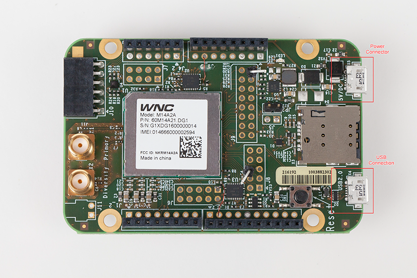
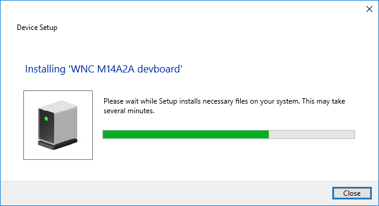
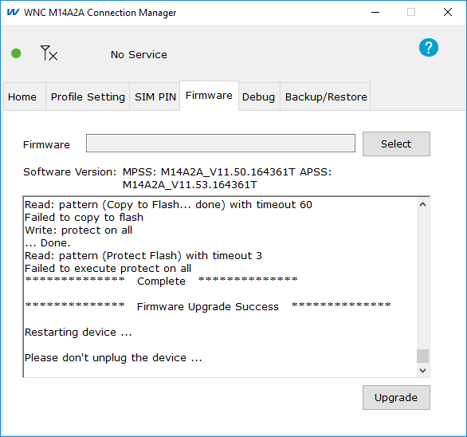

# Cellular Shield Firmware Upgrade

|   Author   | Created At  |
| ---------- | ----------- |
|   rjfinn   | 2016-11-19  |

------

### Intro

From time to time, WNC releases firmware updates for the WNC Cellular Shield. These updates fix known issues with the board's firmware or may add or update software capabilities on the board. This tutorial describes the steps you must perform to install the firmware update. There are a few weird instructions in here, so you shouldn't just plug the board in and get to work. Instead, please make sure to read through the instructions first to ensure you don't skip or rush through a step.  

**NOTE:** This does require a Windows PC for running the WNC Connection Manager (WNCCM).

### Steps

In this tutorial, you'll complete the following steps:

1.	Prepare a Windows system for the firmware upgrade by manually installing the device drivers for the WNC Cellular Shield.
2.	Connect the WNC Cellular Shield to the Windows PC.
3.	Install the firmware update onto the WNC Cellular Shield.

### Requirements

+	Windows computer (the firmware upgrade is not currently available for Mac OS or Linux computers)
+	WNC Firmware update file
+	WNC Cellular Shield
+	WNC Power Supply
+	USB 2.0 Cable

### Instructions

Before starting the firmware update process, please take a moment to address the following:

+ If the WNC Cellular Shield is mounted to the FRDM-K64F development board, separate the boards before starting this process. For this upgrade, you will work with the WNC Cellular Shield independently.
+ Do not connect the WNC Cellular Shield to the PC until instructed to do so.

To upgrade the firmware on the WNC Cellular Shield, perform the following steps:

1.	If the WNC Cellular Shield is mounted on the FRDM-K64F development board, disconnect (separate) the boards.
2.	[Download the WNC Cellular hardware driver](https://s3-us-west-2.amazonaws.com/starterkit-assets/M14A2A_driver_1.0.2.exe). The file name will be a variation of `M14A2A_driver_x.x.x`; always use the highest version number if possible.
3.	Once the driver has completed downloading, double-click on the downloaded file to start the driver installation. During installation, accept all of the default installation options.
4.	This is where the installation gets interesting. To ensure everything works correctly, the driver must be installed three times. So, double-click on the downloaded driver file (`M14A2A_driver_x.x.x.exe`) again. This second install uninstalls the hardware drivers and all associated files followed by a system reboot. Once Windows comes up again after the reboot, double-click on the downloaded driver file a final time to re-install the driver. This third installation ensures that all the correct/latest driver components are installed correctly.
5.	Connect the power supply to the WNC Cellular Shield board to the 5V/DC connector shown in the upper-right corner of the following figure.  

	

6.	Connect the WNC Cellular Shield to the PC using a USB cable. On the WNC Cellular Shield, the USB port is labeled `USB 2.0` and is located in the lower-right corner of the previous figure.

	The PC should automatically recognize the WNC Cellular Shield and install the appropriate drivers into the system's configuration. If the computer displays a warning indicating that it doesn't recognize the newly connected hardware, try uninstalling and re-installing the M14A2A_driver_x.x.x.exe device driver.

	

	After the drivers are loaded and WNC Shield connected, leave it connected and powered up while attached to the PC.

7.	[Download the WNC Connection Manager (WNCCM) software (WNCCM_1.0.1.msi)](https://s3-us-west-2.amazonaws.com/starterkit-assets/WNCCM_1.0.1.msi).  Double-click the downloaded file to begin the installation.  When the connection manager install completes, the PC will create a network adapter for the WNC Shield Board.

	> **Note:** Do not perform this installation while the WNC Cellular Shield is connected to the FRDM-K64F development board, as the update might fail.

8. [Download the firmware update](https://s3-us-west-2.amazonaws.com/starterkit-assets/CM_MPSS_M14A2A_v11.50.164451.zip). The download is a zip file named `CM_MPSS_M14A2A_vxx.xx.xxxxxx.zip`, where the x's represent version information included in the file name. Once you've downloaded the file, extract the files from the zip file to a folder on the PC.
9.	Open the **WNC Connection Manager** application; the application was installed in the Windows programs menu under the **WNC** subfolder.
10.	When the application launches, select the **Firmware** tab. Click the **Select** button and select the folder where the firmware was extracted. The zip file contains a folder matching the zip file name, so you'll want to select that folder. Be sure to select the folder, not any files within the folder.

	")

11.	Click the Upgrade button.

	> **Note:** The firmware update process can take up to 10 minutes. At some point during the upgrade, the application will display a message asking you to "Wait for device automatic reset". In some cases, the device may not automatically reset., so if the process does not start after 3 mins, reset the WNC-Shield by pressing the **Reset** button. The Reset button is located in the lower-right corner of the Cellular Shield, right behind the USB connection on the board.

	As the upgrade progresses, the WNCCM application will update its status pane to indicate progress. Don't forget that this process will take about 10 minutes, so be patient until you see a "Firmware Upgrade Success" message as shown below.

	

	If the device doesn't restart after a few minutes, press the **Reset** button to force the restart.

12.	When the upgrade completes, the Cellular Shield board should automatically reboot and the WNC Connection Manager will display the new software version on the **Firmware** tab.
13.	Exit the Configuration Manager and power down the WNC-Shield by removing the USB cables; the firmware update is complete.
