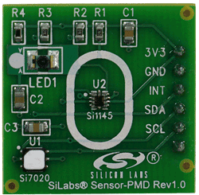
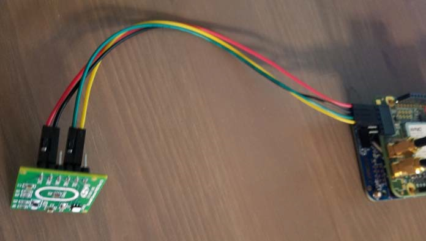
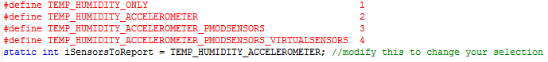

# Extending the Starter Kit Project With The Silicon Labs PMOD Sensor

|   Author   | Created At  | Updated On  |
| ---------- | ----------- | ----------- |
| johnwargo  | 2016-10-11  | 2016-10-12  |

------

### Intro

The [sample project for the AT&T IoT Starter Kit](https://starterkit.att.com/quickstart) illustrates how to capture environment data from an IoT device and upload it to the AT&T M2X service through AT&T Flow. The project captures and uploads the following sensor data:

+ X, Y and Z-axis readings from the FXOS8700CQ 6-axis sensor (accelerometer and magnetometer) on the FRDM-K64F board.
+ Temperature and humidity values from the HTS221 sensor on the cellular shield.

The starter kit project, however, was coded to accept input from a variety of sensors. In this tutorial, you'll learn how to connect the Silicon Labs PMOD Sensor Auxiliary Board to the starter kit's cellular shield and modify the project's firmware to capture data from the sensor and sent it to M2X for storage and display. The sensor captures proximity, ambient & infrared light and UV index for transmission to M2X.

**Note:** This tutorial assumes you've already completed the [AT&T IoT Starter Kit tutorial](https://starterkit.att.com/quickstart) project and have operational AT&T Flow, AT&T M2X and mbed Developer accounts with the project code loaded. If you haven't worked through that project, start there and return here once you have it running. 
 
### Steps

For this tutorial, you'll complete the following steps:

1. Connect a Silicon Labs PMOD Sensor Auxiliary Board to the AT&T IoT Starter Kit's WNC M14A2A cellular shield.
2. Modify the project's firmware so it reads values from the PMOD board and uploads it to M2X.
3. Use AT&T M2X to view the collected sensor data.  

#### Connecting the Silicon Labs PMOD Sensor Auxiliary Board

The [Silicon Labs PMOD Sensor Auxiliary Board](http://www.silabs.com/products/sensors/pages/sensor-pmod.aspx) uses the Si7020 humidity and temperature sensor plus the Si1145 optical sensor that includes the following sensors:

+ Integrated infrared proximity detector
+ Integrated ambient light sensor
+ Integrated UV index sensor   

The following figure shows a close-up of the board.
 

**Note:** *The board includes temperature and humidity sensors, but we won't be using them in this tutorial as they're redundant with the HTS221 sensor on the WNC-Shield card.*

The pinouts on the Si1145 do not align with the cellular shield's PMOD connector (J10), so you'll have to use a cable to connect the boards. Grab a 4-wire ribbon cable or 4 individual wires and connect the two boards using the connection information provided in the following table:

| Signal | J10 (Shield) | SiLabs PMOD | Color in the image below |
| ------ | ------------ | ----------- | ------------------------ |
| VCC    | Pin 6        | Pin 6       | Red                      |
| GND    | Pin 5        | Pin 5       | Black                    |
| SDA    | Pin 4        | Pin 3       | Green                    |
| SCL    | Pin 3        | Pin 2       | Yellow                   |
 
The following figure shows the completed connection between the FRDM-K64F and the Silicon Labs PMOD Sensor Auxiliary Board  

#### FRDM-K64F Software Modifications

With the boards connected, now it's time to tweak the project firmware (the custom code that runs on the FRDM-K64F to talk to sensors and interface with the cellular shield to upload data to AT&T M2X through AT&T Flow). To access the project firmware, open your browser of choice and navigate to [https://developer.mbed.org](https://developer.mbed.org) then open the AT&T IoT Starter Kit project you have already forked. 

Open the `config_me.h` file shown in the following figure.

  

The application project uses constants to define different sensor configurations; you can see the constants in the code sample below:
 
	// Specify here how many sensor parameters you want reported to FLOW.
	// You can use only the temperature and humidity from the shield HTS221
	// or you can add the reading of the FXO8700CQ motion sensor on the FRDM-K64F board
	// or if you have a SiLabs PMOD plugged into the shield, you can add its proximity sensor,
	// UV light, visible ambient light and infrared ambient light readings
	// If you run the Windows "Sensor Simulator" utility, 8 additional virtual
	// sensors can also be made available via USB.
	#define TEMP_HUMIDITY_ONLY                                      1
	#define TEMP_HUMIDITY_ACCELEROMETER                             2
	#define TEMP_HUMIDITY_ACCELEROMETER_GPS                         3
	#define TEMP_HUMIDITY_ACCELEROMETER_PMODSENSORS                 4
	#define TEMP_HUMIDITY_ACCELEROMETER_PMODSENSORS_VIRTUALSENSORS  5

The value for `iSensorsToReport` tells the application which collection of sensors to read values from:

	static int iSensorsToReport = TEMP_HUMIDITY_ACCELEROMETER;   

Currently, the application is set to measure temperature, humidity and accelerometer values and upload that data to AT&T M2X through AT&T Flow. Now that you've added the Silicon Labs PMOD Sensor Auxiliary Board to the project, change the value assigned to `iSensorsToReport` to `TEMP_HUMIDITY_ACCELEROMETER_PMODSENSORS` so PMOD sensor values will be sent to AT&T M2X as well. With this change, the `iSensorsToReport` assignment will be: 
 
	static int iSensorsToReport = TEMP_HUMIDITY_ACCELEROMETER_PMODSENSORS;

With the change in place, compile the application and deploy the updated binary to your FRDM-K64F board using the instructions in the Starter Kit tutorial. At this point, the board will start reading values from the PMOD sensor and sending them to AT&T M2X.

#### Viewing the Results in AT&T M2X

To confirm that the correct data is sent to AT&T Flow, point your browser of choice to [flow.att.io](https://flow.att.io/). Open the Starter Kit Flow project then click the Debug tab at the bottom of the screen. You should begin seeing messages displaying the updated data from the FRDM-K64F board. The debug messages should display sensor readings as a JSON string in the following format:

	"temp": "some_value", "humidity": "some_value", "accelX": "some_value", "accelY": "some_value", "accelZ": "some_value", "proximity": "some_value", "light_uv" : "some_value", "light_vis": "some_value"

Replacing `some_value` with the appropriate data for the measurements, of course.

To see the data in M2X, login to the M2X console by pointing your browser of choice to [m2x.att.io](https://m2x.att.com/). In M2X, open the Starter Kit Device, then look for the different Streams sent to M2X from Flow. You should be able to view data streams from the PMOD sensors.  

**Note:** You can select how many values you want to view from the drop-down box below the graph.
