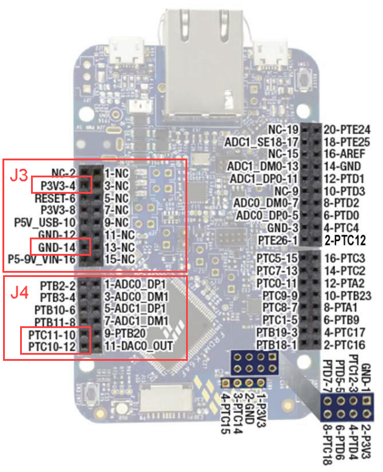

# Extending the Starter Kit Project With The Xadow GPS Module

|   Author   | Created At  | Updated On  |
| ---------- | ----------- | ----------- |
| johnwargo  | 2016-10-12  | 2016-10-18  |

------

### Intro

The [sample project for the AT&T IoT Starter Kit](https://starterkit.att.com/quickstart) illustrates how to capture environment data from an IoT device and upload it to the AT&T M2X service through AT&T Flow. By default, the project captures and uploads the following sensor data:

+ X, Y and Z-axis readings from the FXOS8700CQ 6-axis sensor (accelerometer and magnetometer) on the FRDM-K64F development board.
+ Temperature and humidity values from the HTS221 sensor on the cellular shield.

The starter kit project, however, was coded to accept input from a variety of sensors. In this tutorial, you'll learn how to connect the [Seeed Studio Xadow GPS v2](https://www.seeedstudio.com/Xadow-GPS-v2-p-2557.html) module to the starter kit's cellular shield. Once connected, you'll modify the starter kit sample project's firmware to enable the GPS capabilities of the application. With the modification, the FRDM-K64F will retrieve geolocation information from the GPS module then sent it to M2X for storage and display.

**Note:** This tutorial assumes you've already completed the NEED_THE_RIGHT_LINK_HERE [AT&T IoT Starter Kit tutorial](https://starterkit.att.com/quickstart) project and have operational AT&T Flow, AT&T M2X and mbed Developer accounts with the project code loaded. If you haven't worked through that project, start there and return here once you have it up and running. 
 
### Steps

In this tutorial, you'll complete the following steps:

1. Connect a Xadow GPS Module to the AT&T IoT Starter Kit's WNC M14A2A cellular shield.
2. Modify the project's firmware so it reads values from the GPS module and uploads it to M2X through AT&T Flow.
3. Use AT&T Flow and AT&T M2X to view the collected data.

#### About the Xadow GPS Module 

The Xadow GPS v2 module uses the [Quectel GPS L70](http://www.quectel.com/product/prodetail.aspx?id=13) module to connect to multiple orbiting GPS satellites to measure the following:

+ Latitude
+ Longitude
+ Altitude
+ Speed
+ Direction
+ Time 

The module features an integrated chip antenna, so no external antenna is required. For more sophisticated projects, the board also includes several Xadow connectors, enabling the board to connect to other Xadow modules.

For those interested in the technical specifications for the board:

+ Power Supply: 3.3 – 6V (via breakout pins)
+ Clock Speed: 48MHz
+ Power Consumption: 18mA Tracking, 21mA Acquisition
+ Power Saving: Typ. 3mA AlwaysLocate, 7uA Backup Mode, 180uA Standby Mode
+ Channel: 22 (Tracking) / 66 (Acquisition)
+ Update Rate: 1Hz (Default), up to 10Hz
+ Horizontal Position Accuracy: <2.5m CEP
+ Velocity Accuracy:<0.1 m/s
+ Maximum Velocity: Max. 515 m/s
+ Cold/warm start with EASY (tm): 15s/5s
+ Acquisition Sensitivity: -145dBm
+ Tracking Sensitivity: -163dBm
+ Operating Temperature: -40 to 85
+ Protocols: NMEA 0183/PMTK
+ Antenna Type: Chip antenna
+ Interface: Interface with Xadow GSM+BLE through I2C (7-bit address 0x05)
+ Dimensions: 25.37mm X 20.30mm / 1" X 0.8"

#### GPS Module Limitations

On power-up, the Xadow GPS module will start responding to application requests within seconds, but it might take a while before the module delivers valid GPS readings to the application. Ideally, the GPS requires an open view of the sky to track visible satellites. When operating indoors, building materials (roof, walls, etc.) reduce the module's ability to track satellites. For example, indoor testing with the GPS module and cellular shield showed that on cold start, it can take between 5 to 20 minutes for the GPS module to acquire enough satellites for valid readings.  On a restart (warm boot), the satellite connection is immediate. 

When you enable GPS in the AT&T IoT starter kit sample application (described later), code in the application updates a connected console with status information for the GPS module. You will need a terminal application to monitor the output from the development board; the default terminal installed on your development system likely won’t work for this purpose, so follow the instructions at [https://developer.mbed.org/handbook/Terminals](https://developer.mbed.org/handbook/Terminals) to install the necessary software.

With a terminal connection to the development board, as the GPS module initializes and searches for satellites, the starter kit application writes a `V` to the console along with the number of satellites it sees (`V1`, `V2`, etc.).  The application will update this information every 5 seconds. Once the GPS module connects to the minimum number of satellites it needs to get an accurate reading, the console output changes to `A` indicating it's ready report the device's location.

The following figure shows the application's console output on a cold start; notice that it takes a while for the connection to complete.  

The following figure shows the application's console output after restart; notice that the connection is almost immediate.

#### Connecting the Xadow GPS Module

There are several ways to connect the GPS module to the IoT starter kit hardware:

+ Using the cellular shield's PMOD Connector
+ Using the header connections on the FRDM-K64F development board

The following sections describe each connection option.

##### Connecting the Xadow GPS Module to PMOD Connector

The pinouts on the GPS module do not align with the cellular shield's PMOD connector (J10), so you'll have to use a cable to connect the boards. Four signals must connect between the Cellular kit and the Xadow GPS module. Silkscreen text on the back side of the GPS board identifies the signals for the holes. On the PMOD connector (connector J10 on the cellular shield), pin 1 is the pin closest to the antenna bulkhead connectors. Grab a 4-wire ribbon cable or 4 individual wires and connect the two boards using the connection information provided in the following table:

| Signal | Cellular Shield (J10 PMOD) | Xadow GPS Hole | Wire Color in the Figures Below |
| ------ | -------------------------- | -------------- | ------------------------------- |
| V+     | Pin 6                      | VCC            | Red                             |
| Ground | Pin 5                      | GND            | Black                           |
| SDA    | Pin 4                      | SDA            | Green                           |
| SCL    | Pin 3                      | SCL            | Yellow                          |

**Note:** There is only one PMOD connector on the cellular shield, so you will not be able to connect more than one device using that connector. 

The PMOD connector on the cellular Shield ships with male headers soldered to the board, so it's easy to connect female jumper wires to the header. The GPS Module exposes wire holes which enable multiple ways to make these connections, as highlighted in the following figures.

One option is to use IC grabbers to clip the wire holes on the GPS module:

Here's a closeup of the connection highlighting how the clips grasp the holes:

You can solder male headers to the GPS module then connect the boards using female jumper wires:

You can solder connector wires directly to the GPS module:

You can solder a male header to the GPS module and connect some pins directly to the PMOD connector on the cellular shield. 

Unfortunately, this won't cover all of the needed connections, so you'll have to wire in additional connections to complete the required connections:

##### Connecting the Xadow GPS Module to the FRDM-K64F Arduino-compatible Interface

If your project's hardware configuration does not require the cellular shield, or are using the cellular shield's PMOD for another purpose, you can connect the GPS module to the Arduino-compatible interface pins on the FRDM-K64F development board using the instructions in the following table.

| Arduino Connector | Arduino Pin | Xadow GPS Module Pin |
| ----------------- | ----------- | -------------------- |
| J3                | P3V3-4      | VCC                  |
| J3                | GND-14      | GND                  |
| J4                | PTC11-10    | SDA                  |
| J4                | PTC11-12    | SCL                  |

The following figure highlights the Arduino jumper connector blocks and the pins used in this configuration:

#### FRDM-K64F Software Modifications

With the boards connected, now it's time to tweak the project firmware (the custom code that runs on the FRDM-K64F to read sensors and interface with the cellular shield to upload data to AT&T M2X through AT&T Flow). To access the project firmware, open your browser of choice and navigate to [https://developer.mbed.org](https://developer.mbed.org) then open the AT&T IoT Starter Kit project you have already forked. 

In the mbed IDE, open the `config_me.h` file shown in the following figure:

  

The application project uses constants to define the supported sensor configurations; you can see the constants in the code sample below:
 
	// Specify here how many sensor parameters you want reported to FLOW.
	// You can use only the temperature and humidity from the shield HTS221
	// or you can add the reading of the FXO8700CQ motion sensor on the FRDM-K64F board
	// or if you have a SiLabs PMOD plugged into the shield, you can add its proximity sensor,
	// UV light, visible ambient light and infrared ambient light readings
	// If you run the Windows "Sensor Simulator" utility, 8 additional virtual
	// sensors can also be made available via USB.
	#define TEMP_HUMIDITY_ONLY                                      1
	#define TEMP_HUMIDITY_ACCELEROMETER                             2
	#define TEMP_HUMIDITY_ACCELEROMETER_GPS                         3
	#define TEMP_HUMIDITY_ACCELEROMETER_PMODSENSORS                 4
	#define TEMP_HUMIDITY_ACCELEROMETER_PMODSENSORS_VIRTUALSENSORS  5

The value for `iSensorsToReport` tells the application which collection of sensors to read values from:

	static int iSensorsToReport = TEMP_HUMIDITY_ACCELEROMETER;   

As you can see from the example code, by default the application is configured to measure temperature, humidity and accelerometer values. Now that you've added the GPS module to the project, change the value assigned to `iSensorsToReport` to `TEMP_HUMIDITY_ACCELEROMETER_GPS` so location data is sent to AT&T M2X as well. With this change, the `iSensorsToReport` assignment becomes: 
 
	static int iSensorsToReport = TEMP_HUMIDITY_ACCELEROMETER_GPS;

Compile the application and deploy the updated binary to your FRDM-K64F board using the instructions in the Starter Kit tutorial. At this point, the board will start reading values from the PMOD sensor and sending them to AT&T M2X through AT&T Flow.

#### Viewing the Results in AT&T Flow

To confirm that the correct data is sent to AT&T Flow, point your browser of choice to [flow.att.io](https://flow.att.io/). Open the Starter Kit Flow project then click the Debug tab at the bottom of the screen. You should begin seeing messages displaying the updated data from the FRDM-K64F board. By default, with `iSensorsToReport` set to `TEMP_HUMIDITY_ACCELEROMETER`, the following data will be written to the debug console: 

	{ "temp": "some_value", "humidity": "some_value", "accelX": "some_value", "accelY": "some_value", "accelZ": "some_value" }

Replacing `some_value` with the appropriate data for the measurements, of course.

with `iSensorsToReport` set to `TEMP_HUMIDITY_ACCELEROMETER_GPS`, the following data will be written to the debug console:

	{ "temp": "some_value", "humidity": "some_value", "accelX": "some_value", "accelY": "some_value", "accelZ": "some_value", 'gps_valid": "some_value", "latitude": "some_value", "longitude": "some_value", "altitude": "some_value", "speed": "some_value", "course": "some_value" }

You can see an example of the debug message in the following figure:

  

#### Viewing the Results in AT&T M2X

To see the data in M2X, login to the M2X console by pointing your browser of choice to [m2x.att.io](https://m2x.att.com/). In M2X, open the Starter Kit Device, then look for the different Streams sent to M2X from Flow. Look for streams for the different location values:

+ `gps_valid`
+ `latitude`
+ `longitude`
+ `altitude`
+ `speed`
+ `course`  

