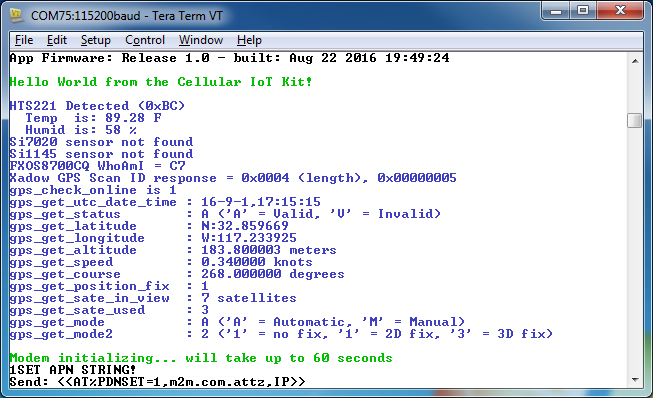
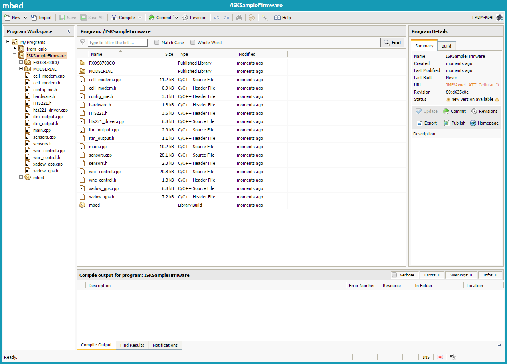

# Extending the Starter Kit Project With The Xadow GPS Module

|   Author   | Created At  | Updated On  |
| ---------- | ----------- | ----------- |
| johnwargo  | 2016-10-12  |             |

------

### Intro

The [sample project for the AT&T IoT Starter Kit](https://starterkit.att.com/quickstart) illustrates how to capture environment data from an IoT device and upload it to the AT&T M2X service through AT&T Flow. By default, the project captures and uploads the following sensor data:

+ X, Y and Z-axis readings from the FXOS8700CQ 6-axis sensor (accelerometer and magnetometer) on the FRDM-K64F development board.
+ Temperature and humidity values from the HTS221 sensor on the cellular shield.

The starter kit project, however, was coded to accept input from a variety of sensors. In this tutorial, you'll learn how to connect the [Seeed Studio Xadow GPS v2](https://www.seeedstudio.com/Xadow-GPS-v2-p-2557.html) module to the starter kit's cellular shield. Once connected, you'll modify the starter kit sample project's firmware to enable the GPS capabilities of the application. With the modification, the FRDM-K64F will retrieve geolocation information from the GPS module then sent it to M2X for storage and display.

**Note:** This tutorial assumes you've already completed the [AT&T IoT Starter Kit tutorial](https://starterkit.att.com/quickstart) project and have operational AT&T Flow, AT&T M2X and mbed Developer accounts with the project code loaded. If you haven't worked through that project, start there and return here once you have it running. 
 
### Steps

In this tutorial, you'll complete the following steps:

1. Connect a Xadow GPS Module to the AT&T IoT Starter Kit's WNC M14A2A cellular shield.
2. Modify the project's firmware so it reads values from the GPS module and uploads it to M2X.
3. Use AT&T M2X to view the collected data.

#### About the Xadow GPS Module 

The Xadow GPS v2 module uses the [Quectel GPS L70](http://www.quectel.com/product/prodetail.aspx?id=13) module to connect to orbiting GPS satellites and measure the following:

+ Latitude
+ Longitude
+ Altitude
+ Speed
+ Direction
+ Time 

The module features an integrated chip antenna, so no external antenna is required. For more sophisticated projects, the board also includes several Xadow connectors, enabling the board to connect to other Xadow modules.

#### GPS Module Limitations

On power-up, the Xadow GPS module will start responding to application requests within seconds, but it might take a while before the module delivers valid GPS readings. Ideally, the GPS requires an open view of the sky to track visible satellites. When operating indoors, building materials (roof, walls, etc.) reduce the module's ability to track sattelites. Indoor testing with the GPS module and cellular shield showed that on cold start, it can take between 5 to 20 minutes for the GPS module to acquire enough satellites for valid readings.  On a restart (warm boot), the satellite connection is immediate. 

When you enable GPS in the AT&T IoT starter kit sample application (described later), code in the application updates a connected console with status information for the GPS module. You will need a terminal application to monitor the output from the development board; the default terminal installed on your development system likely won’t work for this purpose, so follow the instructions at [https://developer.mbed.org/handbook/Terminals](https://developer.mbed.org/handbook/Terminals) to install the necessary software.

With a terminal connection to the development board, as the GPS module initializes and searches for satellites, the starter kit application writes a `V` to the console along with the number of satellites it sees (`V1`, `V2`, etc.).  The application will update this information every 5 seconds. Once the GPS module connects to the minimum number of satellites it needs to get an accurate reading, the console output changes to `A` indicating it's ready report the device's location.

The following figure shows the application's console output on a cold start; notice that it takes a while for the connection to complete.  

The following figure shows the application's console output after restart; notice that the connection is almost immediate.

#### Connecting the Xadow GPS Module

There are several ways to connect the GPS module to the IoT starter kit hardware:

+ Using the cellular shield's PMOD Connector
+ Using the header connections on the FRDM-K64F development board

The following sections describe each connection option.

	### JMW STOPPED HERE ###

##### Connecting the Xadow GPS Module to PMOD Connector

The pinouts on the Si1145 do not align with the cellular shield's PMOD connector (J10), so you'll have to use a cable to connect the boards. Grab a 4-wire ribbon cable or 4 individual wires and connect the two boards using the connection information provided in the following table:

Four signals have to be connected between the Cellular kit and the Xadow GPS module. Silkscreen text on the back side of the GPS board identifies the signals for the holes. On the PMOD, J10 on the cellular shield, pin 1 is the pin closest to the antenna bulkhead connectors.

Only one PMOD connector, so can't do both GPS and 

| Signal | J10 PMOD (Shield) | Xadow GPS hole | Color in the image below |
| ------ | ----------------- | -------------- | ------------------------ |
|VCC     | Pin 6             | VCC            | Red                      |
|GND     | Pin 5             | GND            | Black                    |
|SDA     | Pin4              | SDA            | Green                    |
|SCL     | Pin3              | SCL            | Yellow                   |

There are a number of ways to make these connections on the GPS side and the photographs below show some examples.

IC grabbers:

IC grabbers close-up:

Header pins with jumper wires:

Soldered wires:

The two images below show how the GPS module can be wired to plug directly into a PMOD socket:

##### Connecting the Xadow GPS Module to the FRDM-K64F Arduino-compatible Interface

If you do not have a shield or are using the shield PMOD for another purpose, you can also use the Arduino-compatible interface pins to connect. J4 pin 12 is closest to the RGB LED on the K64F board:

|Signal | Arduino pins | Xadow GPS hole | Color in the image |
| ----- | ------------ | -------------- | ------------------ |
| VCC   | e.g. J3      | pin 4 VCC      | Red                |
| GND   | e.g. J3      | pin 14 GND     | Black              |
| SDA   | J4           | pin 10 SDA     | Green              |
| SCL   | J4           | pin 12 SCL     | Yellow             |

#### FRDM-K64F Software Modifications

With the boards connected, now it's time to tweak the project firmware (the custom code that runs on the FRDM-K64F to talk to sensors and interface with the cellular shield to upload data to AT&T M2X through AT&T Flow). To access the project firmware, open your browser of choice and navigate to [https://developer.mbed.org](https://developer.mbed.org) then open the AT&T IoT Starter Kit project you have already forked. 

Open the `config_me.h` file shown in the following figure.

  

The application project uses constants to define different sensor configurations; you can see the constants in the code sample below:
 
	// Specify here how many sensor parameters you want reported to FLOW.
	// You can use only the temperature and humidity from the shield HTS221
	// or you can add the reading of the FXO8700CQ motion sensor on the FRDM-K64F board
	// or if you have a SiLabs PMOD plugged into the shield, you can add its proximity sensor,
	// UV light, visible ambient light and infrared ambient light readings
	// If you run the Windows "Sensor Simulator" utility, 8 additional virtual
	// sensors can also be made available via USB.
	#define TEMP_HUMIDITY_ONLY                                      1
	#define TEMP_HUMIDITY_ACCELEROMETER                             2
	#define TEMP_HUMIDITY_ACCELEROMETER_GPS                         3
	#define TEMP_HUMIDITY_ACCELEROMETER_PMODSENSORS                 4
	#define TEMP_HUMIDITY_ACCELEROMETER_PMODSENSORS_VIRTUALSENSORS  5

The value for `iSensorsToReport` tells the application which collection of sensors to read values from:

	static int iSensorsToReport = TEMP_HUMIDITY_ACCELEROMETER;   

Currently, the application is set to measure temperature, humidity and accelerometer values and upload that data to AT&T M2X through AT&T Flow. Now that you've added the Silicon Labs PMOD Sensor Auxiliary Board to the project, change the value assigned to `iSensorsToReport` to `TEMP_HUMIDITY_ACCELEROMETER_PMODSENSORS` so PMOD sensor values will be sent to AT&T M2X as well. With this change, the `iSensorsToReport` assignment will be: 
 
	static int iSensorsToReport = TEMP_HUMIDITY_ACCELEROMETER_GPS;

With the change in place, compile the application and deploy the updated binary to your FRDM-K64F board using the instructions in the Starter Kit tutorial. At this point, the board will start reading values from the PMOD sensor and sending them to AT&T M2X.

If you have your mbed IoT Cellular Kit running and connected to the AT&T Flow Designer, debug messages from the HTTP GET input should be visible in Flow. If you look at these debug messages, you will see that they contain the information for these sensor readings in a JSON string:

	"temp": "93.12", "humidity": "57", "accelX": "-0.007", "accelY": "-0.025", "accelZ": "0.988"

The image below illustrates how this appears when viewed in the “Debug” tab at the bottom of the Flow canvas.

If we then re-compile the mbed project and copy the binary to the ‘mbed’ drive, the “Debug” output window should show us the GPS information also, as below.

#### Viewing the Results in AT&T M2X

To confirm that the correct data is sent to AT&T Flow, point your browser of choice to [flow.att.io](https://flow.att.io/). Open the Starter Kit Flow project then click the Debug tab at the bottom of the screen. You should begin seeing messages displaying the updated data from the FRDM-K64F board. The debug messages should display sensor readings as a JSON string in the following format:

	"temp": "some_value", "humidity": "some_value", "accelX": "some_value", "accelY": "some_value", "accelZ": "some_value", "proximity": "some_value", "light_uv" : "some_value", "light_vis": "some_value"

Replacing `some_value` with the appropriate data for the measurements, of course.

To see the data in M2X, login to the M2X console by pointing your browser of choice to [m2x.att.io](https://m2x.att.com/). In M2X, open the Starter Kit Device, then look for the different Streams sent to M2X from Flow. You should be able to view data streams from the PMOD sensors.  

**Note:** You can select how many values you want to view from the drop-down box below the graph.
