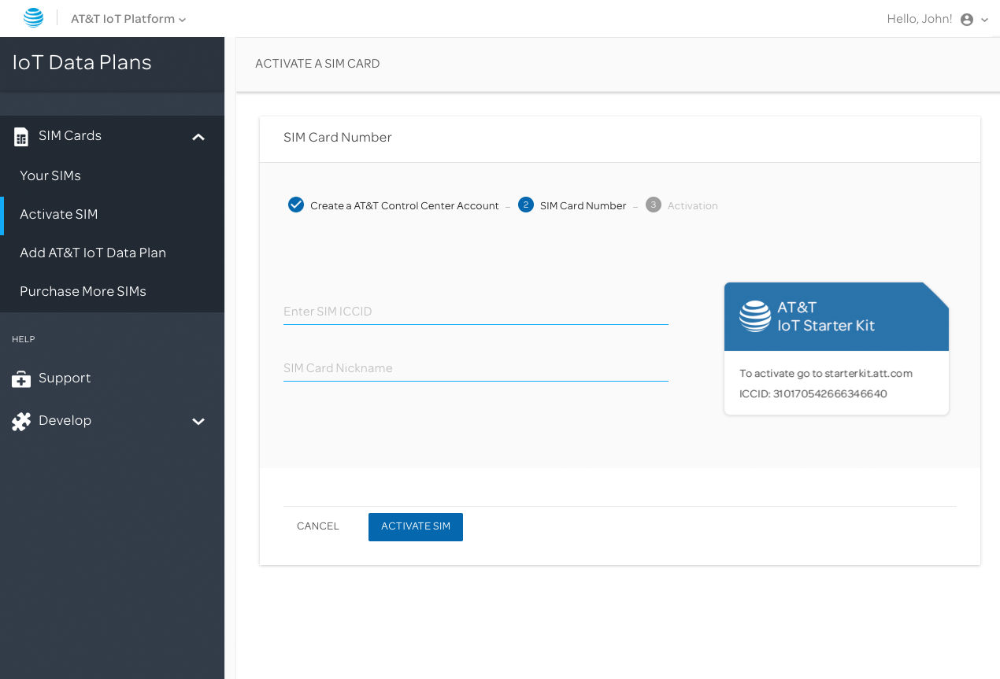
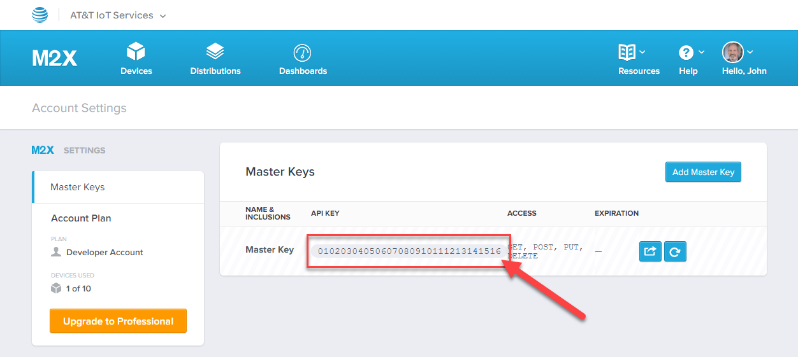
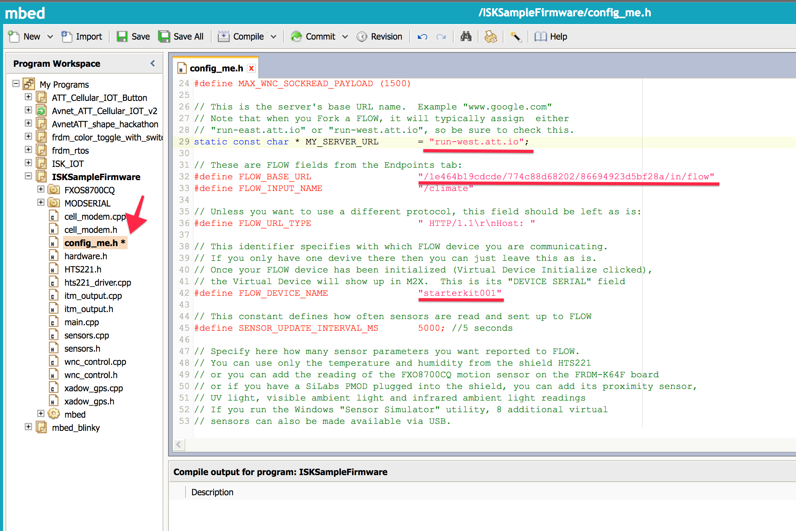

# AT&T IoT Starter Kit Getting Started Guide

|      Author      | Created At | Updated At |
|:----------------:|:----------:| :--------: |
| Starter Kit Team | 2016-10-17 | 2016-11-19 |

**IMPORTANT NOTE:** All IoT Starter Kits need to update their modem firmware to 11.50, [using these instructions: https://starterkit.att.com/tutorials/cellular-shield-firmware-upgrade](https://starterkit.att.com/tutorials/cellular-shield-firmware-upgrade).

# CONTENTS

* [Assembling the Starter Kit](#user-content-menu1 "Assembling the Starter Kit")
* [AT&T IoT Services](#user-content-menu2 "AT&T IoT Services")
  * [AT&T M2X](#user-content-menu3 "AT&T M2X")
  * [AT&T Flow](#user-content-menu4 "AT&T Flow")
* [Sample IoT Project](#user-content-menu5 "Sample IoT Project")
  * [IoT Project Approaches with Flow and M2X](#user-content-menu6 "IoT Project Approaches with Flow and M2X")
  * [Account Setup](#user-content-menu7 "Account Setup")
     * [AT&T M2X Account](#user-content-menu8 "AT&T M2X Account")
     * [SIM Card Registration](#user-content-menu9 "SIM Card Registration")
     * [ARM mbed.org Account](#user-content-menu10 "ARM mbed.org Account")
     * [Optional: Cloudconnectkits.org Account](#user-content-menu11 "Optional: Cloudconnectkits.org Account")
  * [The Expanded Guide to Creating the Flow Application](#user-content-menu12 "The Expanded Guide")
  	 * [Accessing The Flow Dashboard](#user-content-menu13 "Accessing The Flow Dashboard")
  	 * [Forking the Existing Project](#user-content-menu14 "Forking the Existing Project")
  	 * [Configure the Flow Application to Access Your M2X Account](#user-content-menu15 "Configure the Flow Application to Access Your M2X Account")
  	 * [Executing the M2X Setup Flow](#user-content-menu16 "Executing the M2X Setup Flow")
  	 * [Deploying the Project Software to the Development Board](#user-content-menu17 "Deploying the Project Software to the Development Board")
     * [Hardware Setup](#user-content-menu18 "Hardware Setup")
     * [Software Modification](#user-content-menu19 "Software Modification")
     * [Monitoring Activity](#user-content-menu20 "Monitoring Activity")
  * [Quick Guide to Creating the Flow Application](#user-content-menu21 "Quick Guide to Creating the Flow Application")
     * [Flow & M2X Configuration](#user-content-menu22 "Flow & M2X Configuration")
     * [Executing the M2X Setup Flow](#user-content-menu23 "Executing the M2X Setup Flow")
     * [Deploying the Project Software to the Development Board](#user-content-menu24 "Deploying the Project Software to the Development Board")
     * [Hardware Setup](#user-content-menu25 "Hardware Setup")
     * [Software Modification](#user-content-menu26 "Software Modification")
     * [Monitoring Activity](#user-content-menu27 "Monitoring Activity")
         * [Software Application Modifications](#user-content-menu28 "Software Application Modifications")

<p id="user-content-menu1"></p>
## ASSEMBLING THE STARTER KIT


Assembling the IoT SK is easy, simply mount the cellular shield onto the
NXT FRDM-K64F Development Board, attach the antennas then apply
power. Figure 1 shows the development and cellular shield boards ready
to connect. As you can see from the figure, the Arduino pin layout is
designed so that the boards can only align in one orientation. In the lower
portion of the figure, notice that the development board has two rows of
sockets for each connector.  

When mounting the cellular shield on the development board, the
pins from the cellular shield will plug into the outside sockets on the
development board.

  
_Figure 1 – Development Board (bottom) and
Cellular Shield (top)_

Place the cellular shield on the development board, aligning the pins on
the cellular shield with the outside sockets on the development board.
With everything aligned, gently press down evenly on the cellular shield
to connect the boards. Pushing too hard on the boards may damage the
boards

_**Note: When you’re finished, there will be a slight gap between the cellular shield and the
development board sockets; do not expect the board to be flush with the sockets on the
development board.**_  

  
_Figure 2 – Connecting the Development Board and Cellular Shield_

Attach the cellular antennas (Figure 3) to the Cellular Shield using
the metal connectors shown in the lower-left corner of Figure 2. The
connection must be tight, so there’s good connectivity between the
board and the antenna, but not too tight as you might damage the board
or the connector if you tighten it too much.  

  
_Figure 3 – IoT SK Cellular Antennas_  

The IoT SK comes with two micro-USB cables and a power supply. Connect a
USB cable to the micro-USB connector labeled 5V DC on the lower-right
corner of the cellular shield board shown in Figure 4. Connect the other
end of the cable to the power supply as shown in the figure. Due to the pin
configuration of the boards, power supplied to the cellular shield will also
power the development board.  

  
_Figure 4 – Completed Assembly_  

_**Note: The cellular shield has specific voltage requirements, it requires 5V at 2.4A. USB
ports and cell phone chargers provide the necessary 5V, but may not provide the required
current. If using a different power source than one provided with the IoT SK, be sure to check
the power supply’s output specifications to ensure it provides at least 2.4A current. Without the correct input power, the modem will not initialize properly.**_  

The other USB cable is used to connect the development board to a PC in
order to download firmware updates or custom software applications to the board.
Connect the USB cable to the development board using the Micro-USB
connector on the lower-left corner of the development board shown in
Figure 4. Use the connector to the left of the Ethernet port shown in the
figure.  

Finally, activate the SIM using the instructions provided in [SIM Card Registration](#menu9 "SIM Card Registration") then insert the SIM into the cellular shield. The socket for the
SIM is on the cellular shield, right above the development board’s Ethernet
connector shown in Figure 4. Insert the SIM with its metal connectors
facing down toward the cellular shield and the end with the cut-off corner
into the socket first. The SIM socket will hold the SIM in place, so you must
push the SIM all the way into the socket until it clicks before releasing it.

<p id="user-content-menu2"></p>
## AT&T IOT SERVICES

As a mobile carrier, AT&T has the network, billing, support and other services
you’ll need to help guarantee your IoT project’s success. The wireless
network used by smartphones and tablets is the same network you’ll use to
communicate with your IoT devices and for your IoT devices to transmit data.
Where the data goes and what you do with it is the true power behind an IoT
project.

AT&T offers additional services for developers to help streamline the
development of IoT projects and to provide an easy to use storage location for
IoT data.

<p id="user-content-menu3"></p>
### AT&T M2X

AT&T’s M2X is a time-series, cloud-based data storage service and device
management toolset customized for the Internet of Things. IoT projects
generate a lot of data and there’s often no need to pull all of that data into the
corporate data center.

Instead, IoT data is collected and analyzed in place prior to sending relevant insights and metadata to the systems of record and execution engines.
Developers use M2X to organize millions of connected devices, gather data in
real-time, and translate collected data into meaningful information for quick
decisions, automated actions, and strategic analysis.

  
_Figure 5 – M2X Feature Summary & Pricing_  

The AT&T M2X developer tier is free to use for a maximum of 10 devices and
100,000 data points written to the store. You can learn more about AT&T M2X at
[m2x.att.com](http://m2x.att.com "m2x.att.com").

<p id="user-content-menu4"></p>
### AT&T FLOW

AT&T Flow is a development environment tool for IoT projects, based on the open source Node-Red project. With Flow, the development environment has been
enhanced to enable it to run in the cloud, plus adds the following additional
features:

* Applications run in containers for easy cloud distribution
* Version control
* Support for teams
* Sandbox mode
* Enterprise-grade input and output node types
* Can utilize AT&T NetBond for secure transmission of data between device,
cloud, and on-premises network avoiding the public Internet

Flow is an intuitive visual tool that enables IoT app developers to create
prototypes, iterate and improve through multiple versions, then deploy your
application to IoT devices. Flow offers nodes that are pre-configured to allow
easy access to multiple data sources, cloud services, device profiles, and
communication methods. The integrations are already done for you, so you
only have to focus on wiring the building blocks together to create your IoT
application. You can learn more about AT&T Flow at [flow.att.com](http://flow.att.com "flow.att.com").

<p id="user-content-menu5"></p>
## SAMPLE IOT PROJECT

To show you how to utilize the IoT SK and AT&T’s IoT cloud services, for the
remainder of this guide, you’ll work through setting up and executing a prebuilt IoT project using the IoT SK, AT&T Flow and AT&T M2X. The project takes
measurements using the various sensors on the development board then
sends the values to AT&T M2X through AT&T Flow. Special commands, in the
form of JSON strings, are sent back to the development board from the AT&T
Flow application to instruct the device to control on-board components such
as the LED.

**To create this project, you’ll complete the following steps:**

1. Create accounts for the various online services you will use for this project.
2. Activate the developer SIM included in the IoT SK (see ‘[SIM Card Registration](#menu9 "SIM Card Registration")’).
3. Use AT&T Flow to fork the sample project.
4. Update the Flow project to use your AT&T account settings.
5. Deploy the Flow project in the AT&T cloud environment.
6. Configure an ARM mbed software application for your AT&T Flow environment.
7. Deploy the software (.bin file) to the development board.
8. Start collecting data.

To gain an understanding of how we’re structuring the sample project, spend
some time reviewing ‘IoT Project Approaches with Flow and M2X’ before
continuing. You’ll need to use a few online accounts to complete this project, so
you’ll find registration instructions in the ‘Account Setup’ section.
Regarding creating the project; if you’re the impatient type, and don’t need
any hand holding, you’ll find shortcut instructions for this project in ‘Quick Guide to Creating the Flow Application.’ For beginners,
complete, step by step instructions, with pictures, can be found in ‘The Expanded Guide to Creating the Flow Application.’

<p id="user-content-menu6"></p>
### IOT PROJECT APPROACHES WITH FLOW AND M2X

In many simple M2X projects, IoT devices collect data using either built-in or
connected sensors then uploads the recorded data to M2X as shown in Figure
6. Typically, you’ll code the data collection application on the IoT device and
leverage the M2X APIs in the device application to send data to the cloud.

  
_Figure 6 – Sending Data to AT&T M2X_  

More sophisticated IoT applications will use the capabilities of AT&T Flow to
process the collected data in some way; make decisions (in the cloud instead
of on the IoT device) about the data and acting somehow, such as discarding
banal data or executing a trigger to perform a related action.

For this project, you’ll use a pre-built Flow application to collect data from
the IoT SK device, then process the data before sending the data to M2X. the
development board in the IoT SK includes a variety of sensors, so you can
complete the project without needing any additional hardware.

The Flow application takes advantage of its seamless integration with M2X
to create the necessary project definition in M2X and prepare a data store.
Additionally, the Flow project uses triggers to enable the IoT device to
communicate status to the Flow application.

  
_Figure 7 – Sending Data to AT&T M2X Through AT&T Flow_  

For common M2X and Flow applications, you’ll setup your project using the
following steps:

**For common M2X and Flow applications, you’ll setup your project using the following steps:**

1. Setup M2X environment for your project.
2. Create, then deploy a Flow application into the AT&T cloud environment.
3. Deploy software to the development board(s).
4. Begin data collection.

**For our example, the Flow application already exists, and the M2X project setup process is performed by the Flow application, so for this project we’ll use the following workflow:**

1. Configure and deploy a Flow application into the AT&T cloud environment.
2. Deploy software into the AT&T cloud environment.
3. Deploy software to the development board(s).
4. Begin data collection.

<p id="user-content-menu7"></p>
### ACCOUNT SETUP

Before you can start building the project, you’ll need to create some online
accounts for the different sites we’ll use. There are five accounts needed to use
to complete the project; the following subsections will describe how to register
for each.

<p id="user-content-menu8"></p>
#### AT&T M2X ACCOUNT

The core capabilities for this project are provided through AT&T IoT Services;
you’ll create an account there and have access to both M2X and Flow. Sign
up for an AT&T IoT Services account by pointing your browser of choice to
m2x.att.com/signup. as shown in Figure 8. Click the SIGN UP button on the
page’s upper-right corner. On the page that appears (see Figure 9), select the
registration method that makes the most sense for your particular needs and
preferences.

  
_Figure 8 – AT&T M2X Home Page_

  
_Figure 9 – AT&T M2X Registration Page_

If you select to use your GitHub credentials, you will have to authorize AT&T to
access your GitHub credentials as shown in Figure 10.

  
_Figure 10 – AT&T M2X Registration: GitHub Authorization_

Once you complete the registration process, you will use these same
credentials for your AT&T Flow ([https://flow.att.com](https://flow.att.com "flow.att.com")) and AT&T M2X
([https://m2x.att.com](https://m2x.att.com "m2x.att.com")) accounts.

<p id="user-content-menu9"></p>
#### SIM CARD REGISTRATION

**NOTE to Hackathon Participants:** Typically, you will be using a SIM which we already activated.  You can skip registering the SIM.  If you want to use the Control Center API, then you will still need to register to get an API key.

Before you can use the developer SIM that comes with the IoT SK, you must first
register the SIM. Point your browser of choice to [starterkit.att.com/
app/sim-cards](http://starterkit.att.com/app/sim-cards  "starterkit.att.com/app/sim-cards ") then login to the site from the home page (Figure 11). You can
use the AT&T account you created in the previous step to login to this site.

Once you’re logged in, you’ll be taken to the AT&T IoT Starter Kit Dashboard
(Figure 12). From there, click on the Activate SIM link under the SIM Cards menu section to add a SIM 
card to your account.

  
_Figure 11 – AT&T IoT Starter Kit Home Page_

  
_Figure 12 – AT&T IoT Starter Kit Dashboard_

Populate the form with your IoT SK Developer SIM ICCID (you’ll find the number
printed on the face of the SIM card) and give the SIM a nickname (such as
‘Starter Kit’ or ‘IoT SK’). You’ll have to agree to several terms of service before you
can continue.

When the form’s populated and you’ve accepted the terms for all of the
agreements, click the ACTIVATE SIM button on the form to save your changes.  After the SIM is attached to your account it will appear on your Dashboard.  You may need to refresh to see it.  Click on the SIM to expand it change the status from "Test Ready" to "Activated".

Once you complete this registration process, you’ll be able to use the SIM
for free for six months with access to transmit 300 MB of data and 300 SMS
messages.

<p id="user-content-menu10"></p>
#### ARM MBED.ORG ACCOUNT

The project software, the custom code that runs on the development board,
is already compiled and ready to deploy to your IoT SK. However, if your device
is running an older version of the mbed OS or if you want to make changes to
the project’s code, you’ll need access to the ARM mbed web site. To create an
account, point your browser of choice to [developer.mbed.org](http://developer.mbed.org "developer.mbed.org"). On the site’s
home page, click the Log In/Signup button in the header bar (Figure 13) to begin
the process.

Make sure to import the NXP K64F target platform at [https://developer.mbed.org/platforms/FRDM-K64F/](https://developer.mbed.org/platforms/FRDM-K64F/).

  
_Figure 13 – ARM mbed Developer Home Page_

<p id="user-content-menu11"></p>
#### OPTIONAL: CLOUDCONNECTKITS.ORG ACCOUNT

The AT&T IoT SK is produced by Avnet, and they’ve created a developer portal
with developer resources, sample applications and more. This is not required,
but Avnet recommends that you register on their site so you can be notified
of any software updates as well as other pertinent information as it becomes
available. To register with the Avnet portal, point your browser of choice to
[www.cloudconnectkits.org](http://www.cloudconnectkits.org "www.cloudconnectkits.org") then click the Sign In/Register button shown in the
upper-right corner of Figure 14.

  
_Figure 14 – cloudconnectkits.org Home Page_

As part of the registration process, you’ll be asked for the IoT SK Serial Kit Number
as shown in Figure 15. The serial number is the cellular shield serial number
printed on the sticker on top of the metal shield on the cellular shield board
highlighted in Figure 16.

  
_Figure 15 – cloudconnectkits.org Registration_  

  
_Figure 16 – IoT SK Serial Kit Number_

<p id="user-content-menu12"></p>
### THE EXPANDED GUIDE TO CREATING THE FLOW APPLICATION

The AT&T Flow application for this project already exists; you’ll use this existing
application by copying it into your AT&T Flow workspace and modifying it to suit
your account’s configuration and IoT SK hardware. Each AT&T account has unique
account keys that the Flow application needs to operate, so you’ll be copying
them into the existing application project so it can work within your AT&T IoT
Services account.

<p id="user-content-menu13"></p>
#### ACCESSING THE FLOW DASHBOARD

To access the AT&T Flow dashboard, open your browser of choice and navigate
to [http://flow.att.io](http://flow.att.io "flow.att.io"); you’ll see a page similar to the one shown in Figure 17.
Spend a few minutes looking around the IDE to get comfortable.

**Note: Flow will automatically time-out a session after a specific amount of time,
so even though you may have logged in previously, you may have to login again
to access the system.**

  
_Figure 17 – AT&T Flow Dashboard_

For this project, we’re going to use an existing Flow project; because of the
version control capabilities of Flow, we’ll copy the project by forking it.

<p id="user-content-menu14"></p>
#### FORKING THE EXISTING PROJECT

To fork the Starter Kit project, in the browser, navigate to the following URL:
[https://flow.att.io/starter-kit-core/starter-kit-base/home](https://flow.att.io/starter-kit-core/starter-kit-base/home "flow.att.io/starter-kit-core/starter-kit-base/home"); you’ll see a page
similar to the one shown in Figure 18. Next, complete the following steps.

1\. Click the Fork button highlighted in the figure to create a copy of the project
for your exclusive use.

  
_Figure 18 – Starter Kit Reference Project_

2\. In the pop-up dialog that appears (Figure 19), Flow provides you with an
opportunity to rename the project as part of the forking process. The dialog
shows the original project name as both the source and target name for this
project. If you want to use a different name for your project (recommended),
click the target file name and the target file name will change into an input field
as shown in Figure 19. Enter the new name for the project then click the Fork
button to complete the process.

  
_Figure 19 – Forking the Flow Project_


At this point, the forked (and potentially renamed) project will open in the Flow
IDE as shown in Figure 20.

  
_Figure 20 – Flow IDE_

3\. When you first execute a Flow project in AT&T’s cloud environment, the
initial execution container setup takes a few minutes. So, to save time, click
the Deploy button shown in the upper-right corner of Figure 20 to start the
provisioning process. This will compile and activate your project in the Flow
cloud environment. As you make changes to the project and re-deploy,
subsequent deployments will take mere seconds.

<p id="user-content-menu15"></p>
#### CONFIGURE THE FLOW APPLICATION TO ACCESS YOUR M2X ACCOUNT

The Flow application is configured to send measurement data to M2X, but the
application doesn’t know how to do that for your M2X account. So, the next step
is to add your M2X account details to the Flow application. You’ll be copying
information between M2X and Flow, so you’ll want to have either two browser
windows open or two tabs, one open to M2X and the other to Flow.

1\. In M2X, click the ‘Hello, USERNAME’ button in the upper-right corner of the
M2X console then select Account Settings (Figure 21).

  
_Figure 21 – M2X Account Settings_

2\. Highlight the Master Key (Figure 22) and copy it to the clipboard.

  
_Figure 22 – M2X Master Keys_

3\. Switch to the Flow console window (or tab) and open your copy of the sample
project (Figure 23). Select Data tab on the upper-left side of the IDE (1) then
locate the Configuration FUNCTION element (2).

  
_Figure 23 – Flow Application Configuration_

4\. Double-click the Configuration function (highlighted as #2 in Figure 23);
the Flow IDE will open the code editing window shown in Figure 24. Paste M2X
account Master Key you copied in step 2 into the code editor, replacing the
‘<get from M2X>’ text highlighted in the figure. Click the OK button to continue.

  
_Figure 24 – Flow Function Code Editor_

5\. At the bottom of the Flow project’s IDE Window are two tabs: Info and
Endpoints (Figure 25). Click the Endpoints tab to continue.

  
_Figure 25 – Flow IDE Bottom Tab_

A panel will open that lists the endpoints for the project (Figure 26). To finish
the Flow application configuration, we’ll need the Base URL shown in the figure.
Click the Copy button to the right of the Base URL to copy the value to the
clipboard.

  
_Figure 26 – Flow Project Endpoints_

**Note: The project’s endpoints are generated when the application is deployed into the AT&T
cloud environment. If your Endpoints tab is empty, try deploying the application and trying
again. To deploy the application, click the Deploy button in the upper-right corner of the Flow
IDE.**

6\. Double-click the Configuration function (highlighted as #2 in Figure 23) to
open the Flow code editor. The Base URL copied in the previous step is used
to update two variables in the project’s Configuration function. Using the Base
URL shown in Figure 26 as an example (for this step, you’ll want to use the value
you copied from the Endpoints tab):

[https://run-east.att.io/01020304050/998877665544332211/in/flow](https://run-east.att.io/01020304050/998877665544332211/in/flow "run-east.att.io/01020304050/998877665544332211/in/flow")

The Configuration function’s `base_hostname` variable is the hostname portion
of the Base URL (without the https://): `run-east.att.io`. The Configuration
function’s `base_uri` value is everything after the host name (including the
trailing forward slash): `/01020304050/998877665544332211/in/flow`.

In the editor, look for the following code (shown in Figure 27):

**var base_hostname = “<get from Base URL>”;  
var base_uri = “<get from Base URL>”;**

Update the code with the appropriate values from your Base URL as described
above. So, for the example endpoint used above, you would modify the

**var base_hostname = “run-east.att.io”;  
var base_uri = “/01020304050/998877665544332211/in/flow”;**

Click the OK button when you have completed making the change.

  
_Figure 27 – Setting base\_hostname and base\_uri_

7\. With the configuration updated, a blue dot will appear on the upper-right
corner of the Configuration function element as shown in Figure 28. This
indicates that the element’s configuration has changed but has not yet been
deployed. Click the IDE’s Deploy button to deploy the application and resolve
this issue.

  
_Figure 28 – Changes Waiting to be Deployed_


<p id="user-content-menu16"></p>
#### EXECUTING THE M2X SETUP FLOW

The Flow application will automatically create a virtual device for the project in
M2X; all you’ll have to do is kick off the process. This is a one-time operation that
has to be performed.

In the Flow IDE (Figure 29), click on the Virtual Device tab (1) at the top of the
IDE. Locate the project’s Initialize component (2) in the lower-left corner of the
canvas. Click once on the button to the left of the Initialize element (3).

  
_Figure 29 – Initializing M2X_

There’s no direct indication in Flow whether the initialization succeeded or
failed. Notice the green Debug components in the flow application at the
bottom of Figure 29; they’re used to write content to the debug console. Click
the Debug tab shown on the bottom of the figure and Flow will open the Debug
pane shown in Figure 30. Here you can see the message payload data passed
to the Debug component. In this case, the initialization failed because the
initialization process ran a second time and the virtual device already existed.

  
_Figure 30 – Flow Debug Output_

Verify the component has been created in the M2X environment by returning
to your M2X window and clicking Devices. Your virtual device should appear as
shown in Figure 31. If you expand it by clicking the + sign to its left, you will see
the different M2X streams that have been created for it.

  
_Figure 31 – Automatically Registered Virtual Device in M2X_

<p id="user-content-menu17"></p>
#### DEPLOYING THE PROJECT SOFTWARE TO THE DEVELOPMENT BOARD

At this point, you’re ready to deploy the data collection app to the development
board. The NXP FRDM-K64F SBC runs the ARM mBed operating system. ARM
provides operating system updates and and platform development tools.
Developers code applications for the board using a web browser (e.g., Firefox,
Chrome, or Explorer) and removes the need to install tools on an individual’s
PC. We’ll be using some of these tools in this section. Be sure to setup an
account on the ARM mbed web site before continuing; you can find account
setup instructions at ‘ARM mbed.org Account.’

<p id="user-content-menu18"></p>
### Hardware Setup

1\. Mount the cellular shield to the development board using the instructions
provided in ‘Assembling the Starter Kit’ then connect the antennas to the
cellular shield.  
2\. The cellular shield requires 5V power supplied by the included power adapter.
It is not recommended to use a desktop or laptop USB port as a power source
due to the limited current delivered by most USB ports. Plug a micro USB cable
into the 5V USB shield power (X5) on the Cellular shield and connect the other
end of the cable to the provided power supply. The green LED on the cellular
shield (LED1) and the yellow LED on the development board’s Ethernet port will
illuminate.  
3\. Plug a micro USB cable into the SDA USB (J26) port on the FRDM-K64F board.
Connect the other end of the cable to a USB port on your laptop or desktop
computer. Your computer should recognize the device as a standard USB drive
and install the necessary communications software to work with it (Figure 32).

  
_Figure 32 – Windows Explorer Exploring the Development Board_

4\. Verify the development board’s firmware is at version 0226 or higher by
opening the DETAILS.TXT file shown in Figure 32. The current firmware version
is listed in the file and is shown below:


```
Version: 0226
Build: Aug 24 2015 17:06:30
Git Commit SHA: 27a236b9fe39c674a703c5c89655fbd26b8e27e1
Git Local mods: Yes
```

If the firmware version shown is lower than 0226, update it to the latest version
using the instructions found at [https://developer.mbed.org/handbook/
Firmware-FRDM-K64F](https://developer.mbed.org/handbook/Firmware-FRDM-K64F "developer.mbed.org/handbook/Firmware-FRDM-K64F"). If the details.txt file doesn’t exist, the version
information can be found in the mbed.html file; open the file in a text editor to
view version information.

**Note: Be sure to disconnect the cellular shield before attempting the development board firmware update.**

<p id="user-content-menu19"></p>
### Software Modification

Like what you did for the Flow application, you must copy the base software project in order to customize it for your AT&T IoT Services environment.

1\. Open a new browser tab, then navigate to [https://developer.mbed.org/platforms/FRDM-K64F/](https://developer.mbed.org/platforms/FRDM-K64F/) and import this platform into your compiler.  You'll need to create an account if you haven't already.

2\. View the Cellular IoT sample project:  [https://developer.mbed.org/teams/Avnet/code/Avnet_ATT_Cellular_IOT/](https://developer.mbed.org/teams/Avnet/code/Avnet_ATT_Cellular_IOT/). On the page click
the Import into Compiler button highlighted in Figure 33. The development
environment will open start the import process.

  
_Figure 33 – ARM mbed Software Project Page_

3\. During the import process, you will be prompted to update settings that
control the import process (Figure 34); accept the default settings then click
the Import button, optionally changing the project name during the process if
you wish.

  
_Figure 34 – mbed IDE Import Dialog_

  
_Figure 35 – mbed IDE_

4\. Before you can compile the software, you’ll have to change some constants
defined within the application to match your project configuration. In the mbed
IDE Program Workspace window shown on the left side of Figure 35, click the
config_me.h file to open it in the editor. With the file open in the editor, look for
the following code:

```
// This is the server’s base URL name. Example "www.google.com"  
// Note that when you Fork a Flow, it will typically assign either  
// “run-east.att.io” or “run-west.att.io”, so be sure to check this.  
static const char * MY_SERVER_URL = “run-west.att.io”;
```

```
// These are Flow fields from the Endpoints tab:  
\#define FLOW_BASE_URL “/1e464b19cdcde/774c88d68202/86694923d5bf  
28a/in/flow”  
\#define FLOW_INPUT_NAME “/climate”
```

```
// This identifier specifies with which Flow device you are communicating.  
// If you only have one device there then you can just leave this as is.  
// Once your Flow device has been initialized (Virtual Device Initialize clicked),  
// the Virtual Device will show up in M2X. This is its “DEVICE SERIAL” field  
\#define FLOW_DEVICE_NAME “vstarterkit001”
```

To configure the application, you’re going to change the following values:  

* MY_SERVER_URL
* FLOW_BASE_URL
* FLOW_DEVICE_NAME

The values you use here are different than the ones you used earlier. The values
for MY_SERVER_URL and FLOW_BASE_URL are for a Flow application endpoint,
just like you worked with before, but they’re for a specific endpoint in the Flow
application.
Switch back to the Flow IDE and click the Data tab on the top of the IDE window.
Using Figure 36 as a guide, select the Climate GET component (1) then click the
Endpoints tab at the bottom of the window and click the Copy button next to
the Base URL (2) to copy the value to the clipboard.

  
_Figure 36 – AT&T Flow IDE: Climate GET Endpoint_

In the mbed IDE, populate the MY_SERVER_URL constant in the code with the
hostname from the URL you copied in the previous step. Populate the FLOW_
BASE_URL value in quotes with the remainder of the copied Base URL.

To determine the value for FLOW_DEVICE_NAME, open the M2X browser
window and click on the device that the Flow application created earlier then
copy the Device Serial number highlighted in Figure 37.

  
_Figure 37 – AT&T M2X Starter Kit Device Page_

Based on the example provided above, the configuration values should look
something like the following, but using values from your project configuration:

```
static const char * MY_SERVER_URL = “run-east.att.io”;  
\#define FLOW_BASE_URL “/123456789/112233445566778899/in/flow”  
\#define FLOW_DEVICE_NAME “some_device_id”
```

In the mbed IDE, click the Save button along the top toolbar. Next, click the
Compile button. After the source code compiles, the IDE will start to download
the compiled binary. Keep track of the download file name (and location) as
you’ll need the file later.

4\. Disconnect the development board from your computer, wait a few seconds,
then reconnect. Once the development board boots and your computer
recognizes it as a drive, drag the compiled binary you just downloaded onto the
drive (the disk drive representing the development board). This will program
the non-volatile flash memory on the development board with the updated
application software. Programming should take about 10 seconds, during which
time the board’s green LED will flash repeatedly.

5\. Disconnect the development board from the computer and remove the 5V
power from the cellular shield. Then reconnect the cables, connecting the 5V
USB power cable to the power adapter first, followed by the SDA USB cable to
your computer system.

At this point, the development board will boot and begin executing the data
collection app you just installed on the device. If all goes well, data will be
collected and uploaded to M2X through the Flow application.

<p id="user-content-menu20"></p>
### Monitoring Activity

The User LED on the FRDM-K64F board should be RED when the wireless
connection is first powered on. It will turn BLUE when it successfully connects
to the AT&T network and then either green, magenta or turquoise, depending
on the response from the Flow project implementation. The data being sent
can be monitored through the terminal connection that was described in the
previous section.

There’s not much else to see while the application runs. The device collects
data from its sensors and uploads it to the AT&T IoT cloud. As developers,
we all know that nothing ever works as expected the first time, so there’s
probably the need to be able to see what’s happening on the development
board. Unfortunately, the board doesn’t offer a video connection, so there’s
no way to plugin in a monitor and watch the code at work. On the other hand,
the application software writes to the console, so you can remotely monitor
the console to view program output. Your desktop or laptop computer will
communicate with the development board through its serial port. Windows,
Macintosh and Linux computers are supported.

Windows users will have to install some additional software to get this working.
To install the software, follow the instructions at [https://developer.mbed.org/
handbook/Windows-serial-configuration](https://developer.mbed.org/handbook/Windows-serial-configuration "developer.mbed.org/handbook/Windows-serial-configuration"). After the serial drivers have been
installed, determine which COM port is being used by opening the device
manager and looking for the COM port information highlighted in Figure 38.

  
_Figure 38 – Windows Device Manager_

You will need to use a terminal application to monitor the output from the
development board. The default terminal installed on your development
system won’t work for this purpose, so follow the instructions at [https://
developer.mbed.org/handbook/Terminals](https://developer.mbed.org/handbook/Terminals "developer.mbed.org/handbook/Terminals") to install the necessary software.

Linux and Macintosh systems will automatically register a connected
development board as a remote device, so there’s no special steps to perform
to configure connectivity for those OS. Windows users must configure the
terminal session following the instructions provided through the previous link.
Default terminal configuration settings should be:

* Baud = 115200
* Stop Bits = 1
* Parity = None
* Data bits = 8
* Flow Control = none
* COM port set appropriately (Figure 38)

With everything installed and operating, you should be able to see the software
application’s output in the terminal window as shown in Figure 39. In this
example, the development board has just powered up and it is initializing the
cellular shield.

  
_Figure 39 – Terminal: Initializing the Cellular Shield Model_

Once the modem initializes, the app will start sending data to AT&T M2X
through AT&T Flow. Figure 40 shows application output as it sends sensor data
to the cloud. In the figure, you can see the AT commands sent to the modem by
the application as well as the results of the HTTP call to the AT&T cloud.

  
_Figure 40 – Terminal: Sending Data to the AT&T IoT Cloud_

To verify messages from the board are arriving in Flow, open the Flow project,
and then click the Debug tab at the bottom of the IDE window. The Flow
application sends debug messages to this console from many parts of the
application, you can see some example output in Figure 41. Look for green
Debug components in the Flow application to see all the places that write to the
debug console.

  
_Figure 41 – AT&T Flow Debug Console_

To verify messages from the board are arriving in Flow, open the Flow project,
and then click the Debug tab at the bottom of the IDE window. The Flow
application sends debug messages to this console from many parts of the
application, you can see some example output in Figure 41. Look for green
Debug components in the Flow application to see all the places that write to the
debug console.

  
_Figure 42 – AT&T M2X Graphing Sensor Data_

<p id="user-content-menu21"></p>
### QUICK GUIDE TO CREATING THE FLOW APPLICATION

The AT&T Flow application for this project already exists; you’ll use this existing
application by copying it into your AT&T Flow workspace and modifying it to suit
your account’s configuration and IoT SK hardware. Each AT&T account has unique
account keys that the Flow application needs to operate, so you’ll be copying
them into the existing application project so it can work within your AT&T IoT
Services account.

<p id="user-content-menu22"></p>
#### FLOW & M2X CONFIGURATION

1\. Open your default browser, then navigate to the following URL: [https://flow.
att.io/starter-kit-core/starter-kit-base/home](https://flow.att.io/starter-kit-core/starter-kit-base/home "flow.att.io/starter-kit-core/starter-kit-base/home"). Click the Fork button to create a
copy of the project for your exclusive use.

2\. To save time, click the Deploy button to start the provisioning process. This
will compile and activate your project in the Flow cloud environment. As you
make changes to the project and re-deploy, subsequent deployments will take
mere seconds.

3\. The Flow application is configured to send measurement data to M2X, but the
application doesn’t know how to do that for your M2X account. So, the next step
is to add your M2X account details to the Flow application. You’ll be copying
information between M2X and Flow, so you’ll want to have either two browser
windows open or two tabs, one open to M2X and the other to Flow.

In M2X, click the ‘Hello, USERNAME’ button in the upper-right corner of the M2X
console then select Account Settings. Copy the Master Key to the clipboard.

4\. Switch to the Flow console window (or tab) and open your copy of the sample
project. Select Data tab on the upper-left side of the IDE (1) then locate the
Configuration FUNCTION element (2).

5\. Double-click the Configuration function, the Flow IDE will open the code
editing window. Paste M2X account Master Key you copied in step 2 into
the code editor, replacing the ‘<get from M2X>’ text. Click the OK button to
continue.

6\. At the bottom of the Flow project’s IDE Window are two tabs: Info and
Endpoints. Click the Endpoints tab to continue. A panel will open that lists the
endpoints for the project. To finish the Flow application configuration, we’ll
need the Base URL. Click the Copy button to the right of the Base URL to copy
the value to the clipboard.

**Note: The project’s endpoints are generated when the application is deployed into the AT&T
cloud environment. If your Endpoints tab is empty, try deploying the application and trying
again. To deploy the application, click the Deploy button in the upper-right corner of the Flow
IDE.**

7\. Double-click the Configuration function again to open the Flow code editor.
The Base URL copied in the previous step is used to update two variables in the
project’s Configuration function. Using the Base URL as an example (for this
step, you’ll want to use the value you copied from the Endpoints tab):

[https://run-east.att.io/01020304050/998877665544332211/in/flow](https://run-east.att.io/01020304050/998877665544332211/in/flow "run-east.att.io/01020304050/998877665544332211/in/flow")

The Configuration function’s base_hostname variable is the hostname portion
of the Base URL (without the https://): run-east.att.io. The Configuration
function’s base_uri value is everything after the host name (including the
trailing forward slash): /01020304050/998877665544332211/in/flow.

In the editor, look for the following code:

```
var base_hostname = “<get from Base URL>”;  
var base_uri = “<get from Base URL>”;
```

Update the code with the appropriate values from your Base URL as described
above. So, for the example endpoint used above, you would modify the

```
var base_hostname = “run-east.att.io”;  
var base_uri = “/01020304050/998877665544332211/in/flow”;
```

Click the OK button when you have completed making the change.

8\. With the configuration updated, a blue dot will appear on the upper-right
corner of the Configuration function component. This indicates that the
element’s configuration has changed but has not yet been deployed. Click the
IDE’s Deploy button to deploy the application and resolve this issue.

<p id="user-content-menu23"></p>
#### EXECUTING THE M2X SETUP FLOW

The Flow application will automatically create a virtual device for the project in
M2X; all you’ll have to do is kick off the process. This is a one-time operation that
has to be performed. In the Flow IDE, click on the Virtual Device tab at the top of
the IDE. Locate the project’s Initialize component in the lower-left corner of the
canvas. Click once on the button to the left of the Initialize element.

There’s no direct indication in Flow whether the initialization succeeded or
failed. Notice the green Debug components in the flow application; they’re
used to write content to the debug console. Click the Debug tab and Flow will
open the Debug pane. Here you can see the message payload data passed
to the Debug component. In this case, the initialization failed because the
initialization process ran a second time and the virtual device already existed.

Verify the component has been created in the M2X environment by returning to
your M2X window and clicking Devices. Your virtual device should appear in the
list. If you expand it by clicking the + sign to its left, you will see the different M2X
streams that have been created for it.

<p id="user-content-menu24"></p>
#### DEPLOYING THE PROJECT SOFTWARE TO THE DEVELOPMENT BOARD

At this point, you’re ready to deploy the data collection app to the development
board. The NXP FRDM-K64F SBC runs the ARM mBed operating system. ARM
provides operating system updates and and platform development tools.
Developers code applications for the board using a web browser (e.g., Firefox,
Chrome, or Explorer) and removes the need to install tools on an individual’s
PC. We’ll be using some of these tools in this section. Be sure to setup an
account on the ARM mbed web site before continuing; you can find account
setup instructions at ‘ARM mbed.org Account.’

<p id="user-content-menu25"></p>
### Hardware Setup

1\. Mount the cellular shield to the development board using the instructions
provided in ‘Assembling the Starter Kit’ then connect the antennas to the
cellular shield.

2\. The cellular shield requires 5V power supplied by the included power adapter.
It is not recommended to use a desktop or laptop USB port as a power source
due to the limited current delivered by most USB ports. Plug a micro USB cable
into the 5V USB shield power (X5) on the Cellular shield and connect the other
end of the cable to the provided power supply. The green LED on the cellular
shield (LED1) and the yellow LED on the development board’s Ethernet port will
illuminate.

3\. Plug a micro USB cable into the SDA USB (J26) port on the FRDM-K64F
board. Connect the other end of the cable to a USB port on your laptop
or desktop computer. Your computer should recognize the device as a
standard USB drive and install the necessary communications software
to work with it.

4\. Verify the development board’s firmware is at version 0226 or higher
by opening the DETAILS.TXT; the current firmware version is listed in
the file. If the firmware version shown is lower than 0226, update it to the
latest version using the instructions found at [https://developer.mbed.
org/handbook/Firmware-FRDM-K64F](https://developer.mbed.org/handbook/Firmware-FRDM-K64F "developer.mbed.org/handbook/Firmware-FRDM-K64F").

**Note: Be sure to disconnect the cellular shield before attempting the development
board firmware update.**

<p id="user-content-menu26"></p>
### Software Modification

Like what you did for the Flow application, you must copy the base
firmware project in order to customize it for your AT&T IoT Services
environment.

1\. Open a new browser window, then navigate to [https://developer.mbed.org/teams/Avnet/code/Avnet_ATT_Cellular_IOT/](https://developer.mbed.org/teams/Avnet/code/Avnet_ATT_Cellular_IOT/). On the page
that appears, click the Import into Compiler button. The development
environment will open start the import process.

2\. During the import process, you will be prompted to update settings
that control the import process; accept the default settings then click
the Import button, optionally changing the project name during the
process if you wish.

3\. Before you can compile the software, you’ll have to change some
constants defined within the application to match your project
configuration. In the mbed IDE Program Workspace window, click the
config_me.h file to open it in the editor. With the file open in the editor,
look for the following code:

```
// This is the server’s base URL name. Example "www.google.com"  
// Note that when you Fork a Flow, it will typically assign either  
// “run-east.att.io” or “run-west.att.io”, so be sure to check this.  
static const char * MY_SERVER_URL = “run-west.att.io”;
```

```
// These are Flow fields from the Endpoints tab:  
/#define FLOW_BASE_URL “/1e464b19cdcde/774c88d68202/866949  
23d5bf28a/in/flow”  
/#define FLOW_INPUT_NAME “/climate”
```

```
// This identifier specifies with which Flow device you are
communicating.  
// If you only have one device there then you can just leave this as is.  
// Once your Flow device has been initialized (Virtual Device Initialize
clicked),  
// the Virtual Device will show up in M2X. This is its “DEVICE SERIAL” field  
/#define FLOW_DEVICE_NAME “vstarterkit001”
```

To configure the application, you’re going to change the following
values

* MY_SERVER_URL
* FLOW_BASE_URL
* FLOW_DEVICE_NAME

The values you use here are different than the ones you used earlier. The values
for MY_SERVER_URL and FLOW_BASE_URL are for a Flow application endpoint,
just like you worked with before, but they’re for a specific endpoint in the Flow
application.

Switch back to the Flow IDE and click the Data tab on the top of the IDE window.
Select the Climate GET component then click the Endpoints tab at the bottom
of the window and click the Copy button next to the Base URL to copy the value
to the clipboard.


In the mbed IDE, populate the MY_SERVER_URL constant in the code with the
hostname from the URL you copied in the previous step. Populate the FLOW_
BASE_URL value in quotes with the remainder of the copied Base URL.

To determine the value for FLOW_DEVICE_NAME, open the M2X browser
window and click on the device that the Flow application created earlier then
copy the device ID.

Based on the example provided above, the configuration values should look
something like the following, but using values from your project configuration:

```
static const char * MY_SERVER_URL = “run-east.att.io”;  
/#define FLOW_BASE_URL “/123456789/112233445566778899/in/flow”  
/#define FLOW_DEVICE_NAME “some_device_id”
```

In the mbed IDE, click the Save button along the top toolbar. Next, click the
Compile button. After the source code compiles, the IDE will start to download
the compiled binary. Keep track of the download file name (and location) as
you’ll need the file later.

4\. Disconnect the development board from your computer, wait a few seconds,
then reconnect. Once the development board boots and your computer
recognizes it as a drive, drag the compiled binary you just downloaded onto the
drive (the disk drive representing the development board). This will program
the non-volatile flash memory on the development board with the updated
application firmware. Programming should take about 10 seconds, during which
time the board’s green LED will flash repeatedly.

5\. Disconnect the development board from the computer and remove the 5V
power from the cellular shield. Then reconnect the cables, connecting the 5V
USB power cable to the power adapter first, followed by the SDA USB cable to
your computer system.

At this point, the development board will boot and begin executing the data
collection app you just installed on the device. If all goes well, data will be
collected and uploaded to M2X through the Flow application.

<p id="user-content-menu27"></p>
### Monitoring Activity

The User LED on the FRDM-K64F board should be RED when the wireless
connection is first powered on. It will turn BLUE when it successfully connects
to the AT&T network and then either green, magenta or turquoise, depending
on the response from the Flow project implementation. The data being sent
can be monitored through the terminal connection that was described in the
previous section.

There’s not much else to see while the application runs. The device collects
data from its sensors and uploads it to the AT&T IoT cloud. As developers, we
all know that nothing ever works as expected the first time, so there’s probably
the need to be able to see what’s happening on the development board.
Unfortunately, the board doesn’t offer a video connection, so there’s no way to plugin in a monitor and watch the code at work. On the other hand,
the application firmware writes to the console, so you can remotely
monitor the console to view program output. Your desktop or laptop
computer will communicate with the development board through its
serial port. Windows, Macintosh and Linux computers are supported.

Windows users will have to install some additional software to get
this working. To install the software, follow the instructions at [https://
developer.mbed.org/handbook/Windows-serial-configuration](https://developer.mbed.org/handbook/Windows-serial-configuration "developer.mbed.org/handbook/Windows-serial-configuration"). After
the serial drivers have been installed, determine which COM port is
being used by opening the device manager and looking for the COM
port information.


You will need to use a terminal application to monitor the output
from the development board. The default terminal installed on
your development system won’t work for this purpose, so follow the
instructions at [https://developer.mbed.org/handbook/Terminals](https://developer.mbed.org/handbook/Terminals "developer.mbed.org/handbook/Terminals") to
install the necessary software.

With everything installed and operating, you should be able to see
the firmware application’s output in the terminal window. To verify
messages from the board are arriving in Flow, open the Flow project,
and then click the Debug tab at the bottom of the IDE window. The Flow
application sends debug messages to this console from many parts of
the application. Look for green Debug components in the application
to see all the places that write to the debug console. Finally, when
you switch to M2X, and click on the virtual device the Flow application
created for you, you can view the collected data.

<p id="user-content-menu28"></p>
#### FIRMWARE APPLICATION MODIFICATIONS

The sample application has been created for you, but that doesn’t mean you
have to run it like it was written. In this section, you’ll learn some simple tweaks
to change the application’s behavior.

The data collection application’s reporting frequency is configured to upload
sensor measurements to AT&T’s Flow environment every 5 seconds. To adjust
the update frequency, open the mbed IDE and update the application’s config_
me.h file.

Look for lines that say:

```
// This constant defines how often sensors are read and sent up to FLOW  
/#define SENSOR_UPDATE_INTERVAL_MS 5000; //5 seconds
```

The value for SENSOR_UPDATE_INTERVAL_MS specifies the number of
milliseconds between sensor readings. So, for example, a value of 1000 would
instruct the application to read the sensors every 1 second. Change the value
for SENSOR_UPDATE_INTERVAL_MS to a new value that’s appropriate for your
needs. To read the sensors every minute, for example, you’d change the value
to 60000. Make the appropriate change to this value, save your changes the
compile and deploy the updated application to the development board.

You can also tweak which sensor values are collected. Look through the config_
me.h file for the following entries:

// Specify here how many sensor parameters you want reported to Flow.  
// You can use only the temperature and humidity from the shield HTS221  
// or you can add the reading of the FXO8700CQ motion sensor on the FRDMK64F board  

/ or if you have a SiLabs PMOD plugged into the shield, you can add its  
// proximity sensor, UV light, visible ambient light and infrared ambient  
// light readings  
// If you run the Windows “Sensor Simulator” utility, 8 additional virtual  
// sensors can also be made available via USB.  
/#define TEMP\_HUMIDITY\_ONLY &nbsp;&nbsp;&nbsp;&nbsp; 1  
/#define TEMP\_HUMIDITY\_ACCELEROMETER &nbsp;&nbsp;&nbsp;&nbsp; 2  
/#define TEMP\_HUMIDITY\_ACCELEROMETER_GPS &nbsp;&nbsp;&nbsp;&nbsp; 3  
/#define TEMP\_HUMIDITY\_ACCELEROMETER\_PMODSENSORS &nbsp;&nbsp;&nbsp;&nbsp; 4  
/#define TEMP\_HUMIDITY\_ACCELEROMETER\_PMODSENSORS\_  
VIRTUALSENSORS 5  
//modify this to change your selection  
static int iSensorsToReport = TEMP_HUMIDITY\_ACCELEROMETER;  

The sensor measurements that are collected are controlled by the application’s
iSensorsToReport constant. Modify the value assigned to the constant, using
one of the defines listed in the example above, to change which sensors are
read. Make the appropriate change to this value, save your changes the compile
and deploy the updated application to the development board.
